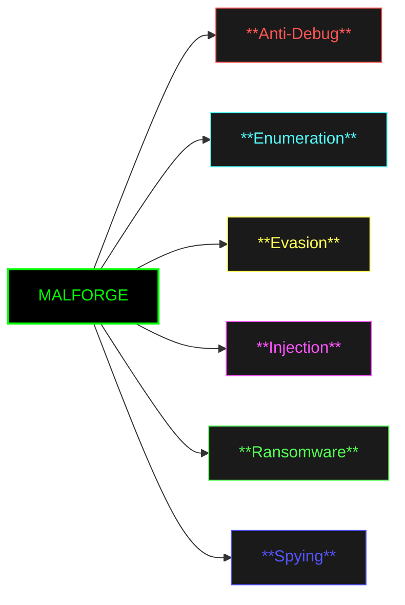

<h1 align="center">
  MALFORGE
</h1>

<!-- Alignment Fix -->
&nbsp;&nbsp;&nbsp;&nbsp;&nbsp;&nbsp;&nbsp;&nbsp;&nbsp;&nbsp;&nbsp;&nbsp;&nbsp;&nbsp;&nbsp;&nbsp;&nbsp;&nbsp;&nbsp;&nbsp;&nbsp;&nbsp;&nbsp;&nbsp;&nbsp;&nbsp;&nbsp;&nbsp;&nbsp;&nbsp;&nbsp;&nbsp;&nbsp;&nbsp;&nbsp;&nbsp;&nbsp;&nbsp;&nbsp;&nbsp;&nbsp;&nbsp;&nbsp;&nbsp;
  [](https://opensource.org/licenses/MIT)   []() []()

## Overview

MalForge API Arsenal is a structured collection of Windows API implementations organized according to malware analysis taxonomy. This project serves as a reference implementation for security researchers, malware analysts, developers and curious learners for building defensive or offensive security solutions.


## Project Structure

The repository is organized into the following categories based on common API usage patterns:



## Purpose

This project is designed for:

- **Security Researchers** - Understanding API-level implementation of various techniques
- **Malware Analysts** - Reference implementations for reverse engineering analysis
- **Defensive Developers** - Building detection mechanisms and security controls
- **Educational Use** - Learning Windows internals and security concepts

## Important Notice

⚠️ **For Educational and Research Purposes Only**

This repository contains implementations of sensitive techniques that could be misused. Users are responsible for:

- Using this code only in authorized environments
- Complying with all applicable laws and regulations
- Implementing proper security controls when testing
- Not deploying these techniques against unauthorized systems

## Getting Started

### Prerequisites

- Windows operating system (Windows 10/11 recommended)
- Visual Studio 2019 or later.
- Administrator privileges (for certain API demonstrations)
- Understanding of Windows API and security concepts

### Building the Project

```bash
# Clone the repository
git clone https://github.com/CyberForgeEx/MALFORGE.git

# Navigate to specific category
cd MALFORGE/..

# Follow category-specific instructions in each folder
```

## Documentation

Each category contains detailed documentation covering:

- API function descriptions and usage
- Implementation examples
- Countermeasures
- References to MALAPI documentation

## Disclaimer

The techniques demonstrated in this repository are powerful and can be harmful if misused. The author not responsible for any misuse or damage caused by this code. This project is intended solely for educational purposes and authorized security research.

## Resources

- [MALAPI.io](https://malapi.io/) - Comprehensive Windows API reference for malware analysis
- [Microsoft Documentation](https://docs.microsoft.com/en-us/windows/win32/api/) - Official Windows API documentation
- [MITRE ATT&CK](https://attack.mitre.org/) - Adversarial tactics and techniques framework

## Acknowledgments

- MALAPI.io for the comprehensive API categorization.
- Microsoft for extensive API documentation.

---

**⚡ Stay Ethical. Stay Legal. Stay Secure.**
