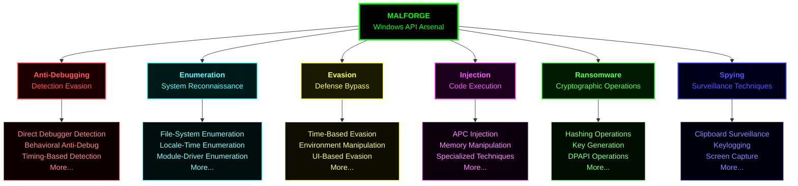

<div align="center">

# 🛡️ MALFORGE
### Windows API Arsenal for Security Research & Malware Analysis

[](https://opensource.org/licenses/MIT)
[](https://www.microsoft.com/windows)
[](https://github.com/CyberForgeEx/MALFORGE)
[](https://github.com/CyberForgeEx/MALFORGE)
[](https://en.wikipedia.org/wiki/C_(programming_language))

*A comprehensive collection of Windows API implementations structured by malware analysis taxonomy for security professionals, researchers and curious learners.*

</div>

---

## 📋 Table of Contents

- [Overview](#overview)
- [Project Architecture](#project-architecture)
- [Getting Started](#getting-started)
- [Documentation](#documentation)
- [Security Considerations](#security-considerations)
- [Contributing](#contributing)
- [Resources](#resources)
- [Acknowledgments](#acknowledgments)

---

## 🔍 Overview

**MALFORGE** is a meticulously structured repository of Windows API implementations, organized according to industry-standard malware analysis taxonomy. This project serves as a comprehensive reference implementation for security researchers, malware analysts, red team operators, and defensive security engineers.

### What is MALFORGE?

MALFORGE provides:
- **Production-Quality Code**: Well-documented, compilable C implementations of security-relevant Windows APIs.
- **Taxonomic Organization**: Structured by MITRE ATT&CK and MALAPI.io categorizations.
- **Dual-Purpose Design**: Supports both offensive security research and defensive mechanism development.
- **Educational Foundation**: Deep-dive technical documentation for learning Windows internals and security concepts.

### Project Philosophy

This repository is built on three core principles:
1. **Transparency**: Open-source implementations that demystify complex security techniques.
2. **Education**: Comprehensive documentation to facilitate learning and understanding.
3. **Responsibility**: Clear ethical guidelines and responsible disclosure practices.

---

## 🏗️ Project Architecture



### Prerequisites

- **Operating System**: Windows 10 (1809+) or Windows 11
- **Development Tools**: Visual Studio 2019/2022 or MinGW-w64 GCC
- **Permissions**: Administrator privileges for certain demonstrations
- **Knowledge**: Basic understanding of C programming and Windows API concepts
- **Environment**: Isolated virtual machine or test environment recommended.

---

## 🚀 Getting Started

### Installation

```bash
# Clone the repository
git clone https://github.com/CyberForgeEx/MALFORGE.git
cd MALFORGE
```

### Quick Start

#### Option 2: MinGW Command Line

```bash
# Navigate to category
cd <target_directory>

# Compile with GCC
Follow the each seperate documentation guidelines

# Ex: Run (in isolated environment)
ProcessHollowing.exe
```

### Repository Structure

```
MALFORGE/
├── Anti-Debugging/          # Debugger detection implementations
├── Enumeration/             # System reconnaissance techniques
├── Evasion/                 # Defense bypass techniques
├── Injection/               # Code injection methods
├── Ransomware/              # Cryptographic operations
├── Spying/                  # Surveillance techniques
└── README.md               # This file
```

---

## 📚 Documentation

### Module Documentation

Each category contains comprehensive documentation:

- **README.md** - Category overview and technique taxonomy.

### Code Documentation

All implementations include:
- Inline comments explaining API usage.
- Function-level documentation blocks.
- Compilation instructions.
- Expected output examples.

### External Resources

- **[MALAPI.io](https://malapi.io/)** - Windows API reference for malware analysis.
- **[MITRE ATT&CK](https://attack.mitre.org/)** - Adversarial tactics and techniques.
- **[Microsoft Docs](https://docs.microsoft.com/en-us/windows/win32/api/)** - Official Windows API documentation.
- **[Windows Internals](https://www.microsoftpressstore.com/store/windows-internals-part-1-9780735684188)** - Deep dive into Windows architecture.

---

## 🔐 Security Considerations

### Testing Environment

**⚠️ Never execute these techniques on live production systems**

Recommended testing environments:
- **Virtual Machines**: VMware Workstation, VirtualBox, Hyper-V

## 🤝 Contributing

All contributions are welcome from the security research community!

### Contribution Guidelines

1. **Fork the repository** and create a feature branch.
2. **Follow coding standards**: Clean C code, consistent naming conventions.
3. **Document thoroughly**: Inline comments, README updates, API references.
4. **Test extensively**: Verify functionality on multiple Windows versions.
5. **Submit pull request** with detailed description of changes.

### What to Contribute

- New technique implementations
- Improved detection methods
- Documentation enhancements
- Bug fixes and code optimization
- Additional test cases

### Code of Conduct

- Ethical use of techniques.
- Respectful collaboration.
- Educational focus.

---

### Legal Compliance

Users must:
- Obtain explicit authorization before testing on systems.
- Comply with all local, state, and federal laws.
- Follow responsible disclosure practices.
- Implement proper security controls in test environments.
- Not use techniques against unauthorized targets.

### Disclaimer

**THE SOFTWARE IS PROVIDED "AS IS", WITHOUT WARRANTY OF ANY KIND.** The authors and contributors are not responsible for any misuse, damage, or legal consequences resulting from the use of this code. This project is intended solely for educational purposes and authorized security research.

---

## 📖 Resources

### Primary References

| Resource | Description | Link |
|----------|-------------|------|
| **MALAPI.io** | Comprehensive Windows API reference for malware analysis | [malapi.io](https://malapi.io/) |
| **MITRE ATT&CK** | Adversarial tactics and techniques knowledge base | [attack.mitre.org](https://attack.mitre.org/) |
| **Microsoft Docs** | Official Windows API documentation | [docs.microsoft.com](https://docs.microsoft.com/en-us/windows/win32/api/) |
| **Windows Internals** | Deep technical reference for Windows architecture | [Microsoft Press](https://www.microsoftpressstore.com/store/windows-internals-part-1-9780735684188) |

### Additional Learning

- **[LOLBins](https://lolbas-project.github.io/)** - Living Off The Land Binaries and Scripts
- **[Awesome Windows Exploitation](https://github.com/enddo/awesome-windows-exploitation)** - Curated list of Windows security resources
- **[Pentester Academy](https://www.pentesteracademy.com/)** - Offensive security training
- **[SANS Reading Room](https://www.sans.org/white-papers/)** - Security research papers

---

## 🙏 Acknowledgments

This project stands on the shoulders of giants. Special thanks to:

- **[MALAPI.io](https://malapi.io/)** - For comprehensive API categorization and malware analysis framework.
- **Microsoft Documentation** - For extensive Windows API documentation.
- **MITRE Corporation** - For the ATT&CK framework and threat intelligence taxonomy.

### Inspiration

This project was inspired by the need for a centralized, well-documented reference implementation of security-relevant Windows APIs for both offensive and defensive security research.

---

<div align="center">

## ⚡ Stay Ethical. Stay Legal. Stay Secure.

**For questions, discussions, or responsible disclosure:**  
Open an issue or contact [me](mailto:vasandilaksan@gmail.com) through mail.

[](https://github.com/CyberForgeEx/MALFORGE/stargazers)
[](https://github.com/CyberForgeEx/MALFORGE/network/members)
[](https://github.com/CyberForgeEx/MALFORGE/watchers)

---

**© 2025 MALFORGE | Licensed under MIT**

*Built with ❤️ for the security research community*

</div>
